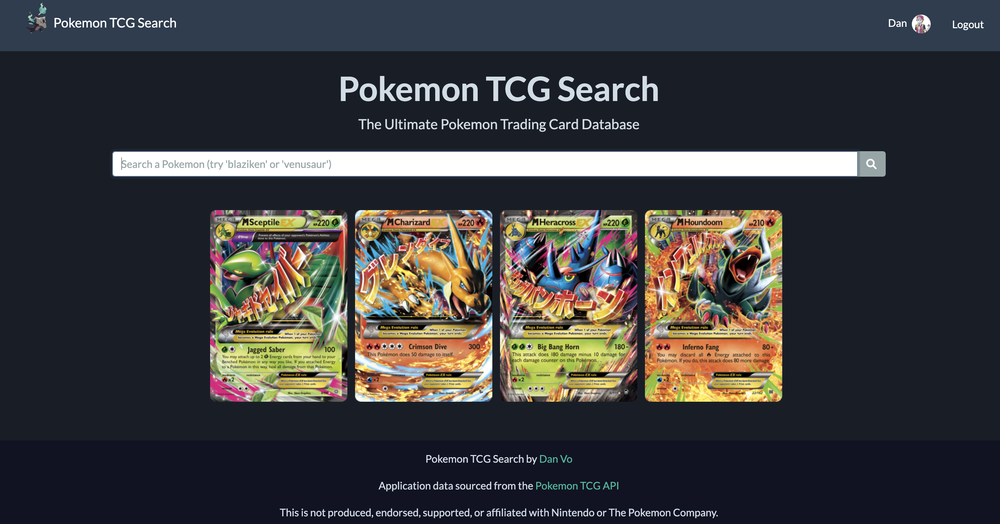
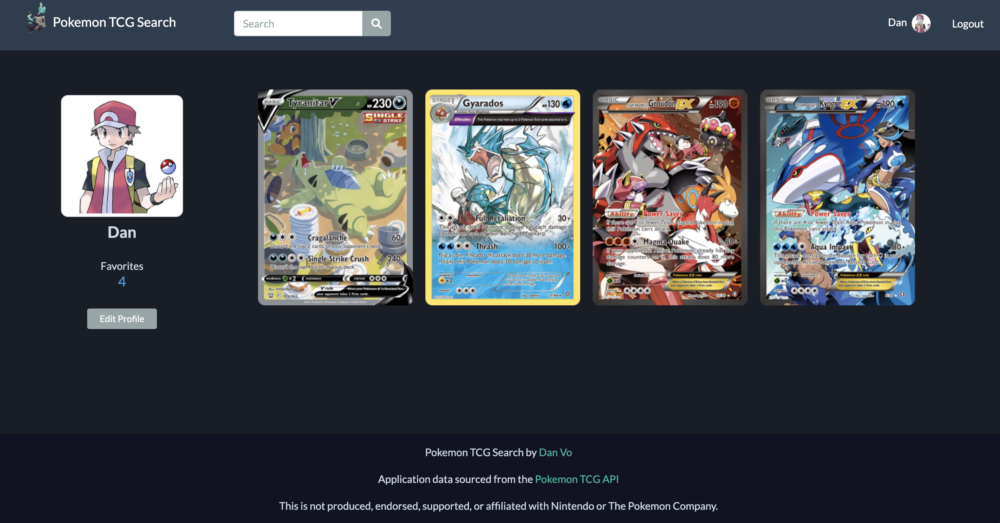
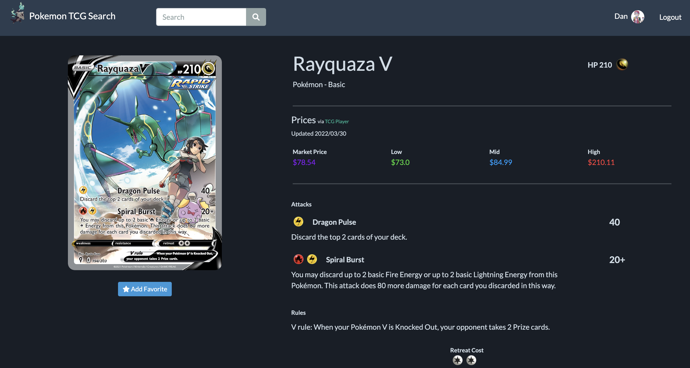

# **Pokemon TCG Search**

Try it out! ---> [Pokemon TCG Search](https://pokemon-tcg-search-dvo.herokuapp.com/).

---

## **Overview**
The goal of this app is to provide users a method to explore a well-documented archive of Pokemon trading cards. 

With the popularity of Pokemon trading card collecting growing exponentially, it would be a useful and fun resource for fans and collectors to search their favorite characters and see their card details (images, statistics, market price, etc) to use as a reference and/or for nostalgic excitement. 

With so many variations of cards with unique artwork, this application provides users a thrilling visual experience. Details for the individual cards include market prices which are updated daily, statistics, and history. 

---

## **Features**

>The main feature of this application is to allow users to search a large and well documented database of Pokemon cards. All users regardless of being logged in, will be able to search cards and see their details.

>Users have the option of creating an account which enables the ability to favorite individual cards they can then view on their own profile.

>When users make a valid search, all cards matching the search will be displayed. 

>Users can then click on the image of a card to see that specific card's details.

---
## **Pokemon TCG API**
This application was created using data from the <ins>**Pokemon TCG API**</ins>. All card details and images are sourced from the API's database. 

#### API Overview
>https://pokemontcg.io/

#### API Documentation:
>https://docs.pokemontcg.io/

---

## **Technologies Used**
- Python
- HTML
- CSS
- Bootstrap 5
- Flask
- Flask-SQLAlchemy
- Flask-WTForms
- Flask-Bcrypt
- Jinja
- unittests
- VSCode

