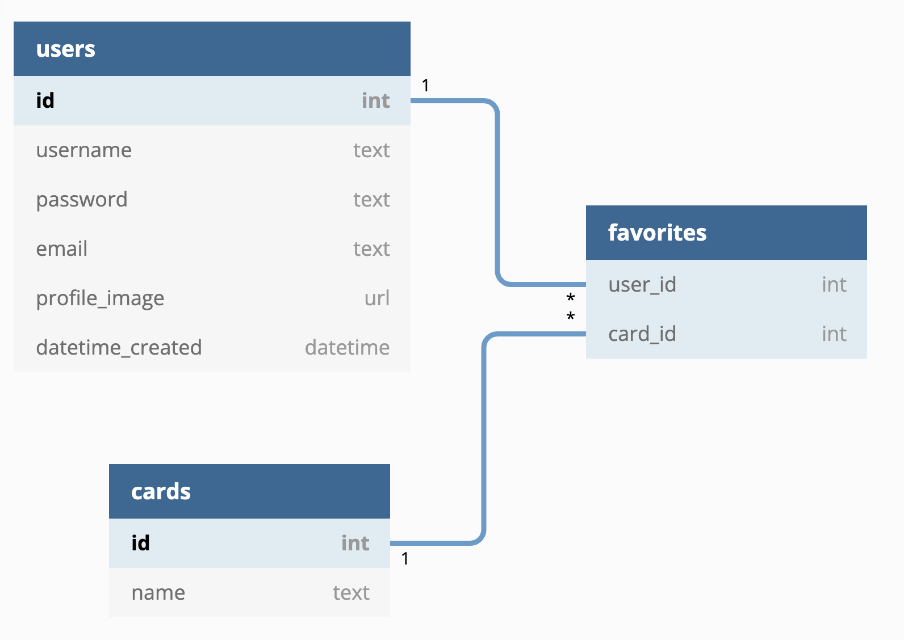

# **Pokemon TCG Search App**

## **Overview:**

The goal of this app is to provide users a method to explore a well-documented archive of Pokemon trading cards. 

With the popularity of Pokemon trading card collecting growing exponentially, it would be a useful resource for fans and collectors to search their favorite characters and see their details (images, statistics, market price, etc).

User Demographics:
- collectors and hobbyists
- a wide range of age groups interested in Pokemon
- Pokemon TCG players who want to strategize and build decks


## **Data Sources:**

The main source of data will be the [Pokemon TCG API](https://docs.pokemontcg.io/). 

> This API provides access to a well-documented database of Pokemon cards which includes high resolution images, statistics, and current market price. 
>
> Users can search cards without entering complete names of the card making it more accessible to anyone interested in using the app. _(ex. User can enter any single letter in the search and it will show all cards that start with that letter)_


## **Database Schema:**


<!--  -->

```py
class User(db.Model):
    """Users in the system."""

    __tablename__ = 'users'

    id = db.Column(db.Integer, primary_key=True)
    username = db.Column(db.Text, nullable=False, unique=True)
    password = db.Column(db.Text, nullable=False)
    email = db.Column(db.Text, nullable=False, unique=True)
    profile_image = db.Column(db.Text, default= DEEFAULT_PROFILE_IMAGE)


class Card(db.Model):
    """Individual Pokemon Trading Card"""

    __tablename__ = 'cards'

    id = db.Column(db.Integer, primary_key=True)
    name = db.Column(db.Text, nullable=False)


class Favorites(db.Model):
    """Mapping user favorites to cards."""

    __tablename__ = 'favorites' 

    user_id = db.Column(db.Integer, db.ForeignKey('users.id', ondelete='cascade'))
    card_id = db.Column(db.Integer, db.ForeignKey('card.id', ondelete='cascade'))
```
	

## **Potential API Issues:** 

- The Pokemon TCG API is very well documented so may not run into many issues with requests
- A challenge that may arise is the development of the models for favoriting cards and making personalized decks


## **Sensitive Information:**

- Encrypted user passwords will be stored
- Users have the option of deleting their accounts, clearing their saved username and password
  

## **Functionality & User Flow**

- Users have the option of setting up a profile if they are interested in saving individual cards to their favorites and also have the ability to make decks (playlists)
- For all users, the first page they see is the search form (e.g. Google Search). There will be details available for users to know how to make a search and examples of search inputs
- When users make a search, all cards matching the search input will display (card image) and users can click on individual cards to see their specific details
- Signed in users can favorite/unfavorite cards as well as create/delete decks they create
- Users also have the option of editing their user profile


## **Beyond CRUD**
Aside from being a search tool, users can create an account, favorite/unfavorite cards, and create/delete decks (similar to creating playlists) that they create.

